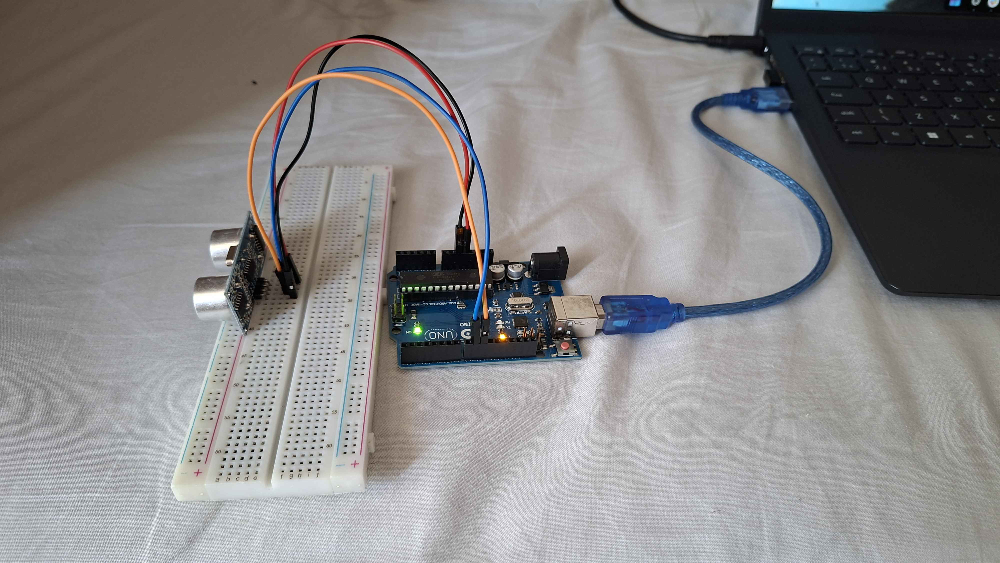

# Sistema de Medição de Estação Meteorológica IoT

Sistema completo de IoT para coleta, armazenamento e visualização de dados meteorológicos. Um Arduino lê a distância via sensor ultrassônico HC-SR04 e envia os dados por Serial USB para um servidor Flask, que converte a distância em valores simulados de temperatura, umidade e pressão, persiste no SQLite e os expõe em uma API REST com interface web.

---

## Circuito



### Componentes

| Componente | Função |
|---|---|
| Arduino Uno | Microcontrolador — lê o sensor e envia dados via Serial USB |
| HC-SR04 | Sensor ultrassônico — mede distância de 2 cm a 400 cm |
| Protoboard | Suporte para conexão do sensor sem solda |
| 4 jumpers | Ligação entre sensor e Arduino |

### Ligações

| Pino HC-SR04 | Pino Arduino | Cor do jumper |
|---|---|---|
| VCC | 5V | Vermelho |
| GND | GND | Preto |
| TRIG | Digital 9 | Laranja |
| ECHO | Digital 10 | Azul |

### Como funciona

O HC-SR04 emite um pulso ultrassônico e mede o tempo até o eco retornar. O Arduino calcula a distância (`duracao * 0.034 / 2`) e envia via Serial no formato JSON:

```json
{"distancia": 45.2}
```

O servidor Python recebe esse valor e o mapeia para variáveis meteorológicas simuladas:

| Variável | Perto (2 cm) | Longe (200 cm) |
|---|---|---|
| Temperatura | 15 °C | 40 °C |
| Umidade | 95 % | 30 % |
| Pressão | 990 hPa | 1030 hPa |

---

## Decisões de Arquitetura

| Elemento | Decisão |
|---|---|
| Hardware | Arduino Uno + HC-SR04. Sem DHT11/BMP180 — todos os valores são derivados da distância |
| Simulação | Mapeamento distância → temperatura/umidade/pressão feito no servidor Python |
| Leitura Serial | `serial_reader.py` roda como processo separado e faz POST para a API Flask |
| Banco de dados | SQLite com WAL mode para permitir escrita simultânea do Flask e do serial_reader |
| Interface | Jinja2 (server-side rendering) + Chart.js para o gráfico temporal |

---

## Estrutura do Projeto

```
Sistema-IoT/
├── docs/
│   └── circuito.jpg        # Foto do circuito montado
└── src/
    ├── app.py              # Aplicação Flask — API REST e rotas HTML
    ├── database.py         # Funções de acesso ao SQLite (CRUD)
    ├── serial_reader.py    # Leitura da porta serial → POST para a API
    ├── schema.sql          # DDL da tabela leituras
    ├── config.py           # Configurações centralizadas (porta, baud, URLs)
    ├── populate_db.py      # Script para inserir 30 leituras de exemplo
    ├── static/
    │   ├── css/style.css
    │   └── js/main.js
    ├── templates/
    │   ├── base.html
    │   ├── index.html      # Painel principal com gráfico e auto-refresh
    │   ├── historico.html  # Histórico paginado
    │   ├── detalhe.html    # Leitura individual
    │   ├── editar.html     # Formulário de edição (PUT)
    │   └── erro.html
    └── arduino/
        └── estacao.ino
```

---

## Instalação

### 1. Pré-requisitos

- Python 3.10 ou superior
- Arduino IDE 2.x (para gravar o sketch)

### 2. Ambiente virtual e dependências Python

```bash
# Na raiz do projeto (pasta Sistema-IoT)
python -m venv venv

# Ativar — Windows
venv\Scripts\activate

# Ativar — Linux/macOS
source venv/bin/activate

# Instalar dependências
pip install flask pyserial requests
```

### 3. Variáveis de configuração (opcional)

As configurações padrão estão em `src/config.py`. Você pode sobrescrevê-las com variáveis de ambiente:

```bash
# Windows (PowerShell)
$env:SERIAL_PORTA = "COM5"
$env:FLASK_DEBUG  = "false"

# Linux/macOS
export SERIAL_PORTA=/dev/ttyUSB0
export FLASK_DEBUG=false
```

---

## Como Executar

### 1. Gravar o sketch no Arduino

1. Abra a Arduino IDE
2. Abra `src/arduino/estacao.ino`
3. Selecione a placa **Arduino Uno** e a porta correta (ex: COM5)
4. Clique em **Carregar (Upload)**

### 2. Inicializar o banco de dados com dados de exemplo

```bash
cd src
python populate_db.py
```

### 3. Iniciar o servidor Flask

```bash
cd src
python app.py
```

Acesse: http://localhost:5000

### 4. Iniciar a leitura serial (em outro terminal, com Arduino conectado)

```bash
cd src
python serial_reader.py
```

> **Atenção:** feche o Serial Monitor da Arduino IDE antes de rodar o `serial_reader.py` — dois programas não podem usar a mesma porta serial ao mesmo tempo.

---

## Rotas da API

| Método | Rota | Descrição |
|---|---|---|
| GET | `/` | Painel com últimas 10 leituras + gráfico |
| GET | `/leituras` | Histórico paginado (`?pagina=1&limite=20`) |
| POST | `/leituras` | Cria leitura — aceita `{"distancia": 45.2}` ou `{"temperatura": 25.0, "umidade": 60.0}` |
| GET | `/leituras/<id>` | Detalhe de uma leitura |
| GET | `/leituras/<id>/editar` | Formulário de edição |
| PUT | `/leituras/<id>` | Atualiza campos — body JSON |
| DELETE | `/leituras/<id>` | Remove a leitura |
| GET | `/api/estatisticas` | Média, mín e máx (`?desde=2024-01-01&ate=2024-12-31`) |

Todos os endpoints GET aceitam `?formato=json` para retornar JSON em vez de HTML.

### Exemplo de POST com sensor ultrassônico (curl)

```bash
curl -X POST http://localhost:5000/leituras \
  -H "Content-Type: application/json" \
  -d '{"distancia": 45.2}'
```

---

## Formato do JSON enviado pelo Arduino

```json
{"distancia": 45.2}
```
